# 🛡️ AnD.wrapper - Technical Analysis

A comprehensive analysis of the **AnD.wrapper** project, a Spring Boot 3.5 backend that acts as an **API Gateway** for an Attack-Defense CTF (Capture The Flag) platform.

---

## 📋 Project Overview

| Aspect | Details |
|--------|---------|
| **Framework** | Spring Boot 3.5.6 |
| **Language** | Java 21 |
| **Architecture** | API Gateway / Proxy Pattern |
| **Database** | PostgreSQL (shared with Python Core) |
| **Authentication** | JWT (JSON Web Tokens) |
| **Build Tool** | Maven |

### Core Purpose
The AnD.wrapper serves as a **security layer and API gateway** between:
- **Frontend clients** (React/Next.js)
- **Python Core API** (game logic, flags, scoring)


---

## 🔧 Key Techniques & Patterns

### 1. API Gateway / Proxy Pattern

The wrapper implements a **proxy architecture** where:
- **Direct management**: User authentication, team management → Direct DB access
- **Proxied operations**: Game control, flag submission, scoreboard → Forward to Python Core

**Implementation**: [CoreApiClient.java](file:///root/AnD.wrapper/src/main/java/com/tool/atkdefbackend/client/CoreApiClient.java)

```java
@Component
public class CoreApiClient {
    private final WebClient webClient;
    
    public <T> T get(String endpoint, Class<T> responseType) {
        return webClient.get()
                .uri(endpoint)
                .retrieve()
                .bodyToMono(responseType)
                .timeout(DEFAULT_TIMEOUT)
                .block();
    }
    
    public <T> T postMultipart(String endpoint, MultiValueMap<String, ?> body, Class<T> responseType) {
        return webClient.post()
                .uri(endpoint)
                .contentType(MediaType.MULTIPART_FORM_DATA)
                .body(BodyInserters.fromMultipartData(body))
                .timeout(Duration.ofMinutes(5)) // Longer for uploads
                .block();
    }
}
```

**Specialized Clients**:
| Client | Purpose |
|--------|---------|
| [GameClient.java](file:///root/AnD.wrapper/src/main/java/com/tool/atkdefbackend/client/GameClient.java) | Game CRUD, control (start/pause/stop), team assignment |
| [SubmissionClient.java](file:///root/AnD.wrapper/src/main/java/com/tool/atkdefbackend/client/SubmissionClient.java) | Flag submission and validation |
| [CheckerClient.java](file:///root/AnD.wrapper/src/main/java/com/tool/atkdefbackend/client/CheckerClient.java) | Checker script upload |
| [VulnboxClient.java](file:///root/AnD.wrapper/src/main/java/com/tool/atkdefbackend/client/VulnboxClient.java) | Vulnerable box Docker image upload |
| [ScoreboardClient.java](file:///root/AnD.wrapper/src/main/java/com/tool/atkdefbackend/client/ScoreboardClient.java) | Real-time scoreboard data |
| [TickClient.java](file:///root/AnD.wrapper/src/main/java/com/tool/atkdefbackend/client/TickClient.java) | Game tick information |
| [FlagClient.java](file:///root/AnD.wrapper/src/main/java/com/tool/atkdefbackend/client/FlagClient.java) | Flag management |

---

### 2. JWT Authentication & Authorization

**Implementation**: [WebSecurityConfig.java](file:///root/AnD.wrapper/src/main/java/com/tool/atkdefbackend/config/security/WebSecurityConfig.java)


**Key Security Features**:

| Feature | Implementation |
|---------|---------------|
| **Password Hashing** | BCrypt with strength 12 (2^12 iterations) |
| **Token Signing** | HMAC-SHA256 with 256-bit secret key |
| **Session Management** | Stateless (no server-side sessions) |
| **Token Expiration** | Configurable (default 24h) |

**JWT Token Structure** ([JwtUtils.java](file:///root/AnD.wrapper/src/main/java/com/tool/atkdefbackend/config/security/JwtUtils.java)):
```java
return Jwts.builder()
        .setSubject(userPrincipal.getUsername())
        .claim("displayName", userPrincipal.getDisplayName())
        .claim("userId", userPrincipal.getId())
        .claim("teamId", userPrincipal.getTeamId())
        .claim("teamName", userPrincipal.getTeamName())
        .claim("roles", roles)
        .setIssuedAt(new Date())
        .setExpiration(new Date(System.currentTimeMillis() + jwtExpirationMs))
        .signWith(signingKey, SignatureAlgorithm.HS256)
        .compact();
```

---

### 3. Role-Based Access Control (RBAC)

Three primary roles with hierarchical permissions:

```mermaid
graph TD
    ADMIN["🔴 ADMIN<br/>Full System Access"]
    TEACHER["🟡 TEACHER<br/>Game & Team Management"]
    STUDENT["🟢 STUDENT<br/>Limited to Own Team"]
    
    ADMIN --> TEACHER
    TEACHER --> STUDENT
```



**Permission Matrix**:

| Endpoint | ADMIN | TEACHER | STUDENT |
|----------|:-----:|:-------:|:-------:|
| Create Game | ✅ | ❌ | ❌ |
| Start/Stop Game | ✅ | ❌ | ❌ |
| List Games | ✅ | ✅ | ✅ |
| View Game Details | ✅ | ✅ | ✅ |
| Manage Teams | ✅ | ✅ | ❌ |
| Submit Flags | ✅ | ✅ | ✅ (own team only) |
| View Own Submissions | ✅ | ✅ | ✅ |
| View All Submissions | ✅ | ✅ | ❌ |
| Upload Checker/Vulnbox | ✅ | ❌ | ❌ |

**Implementation with `@PreAuthorize`** ([GameProxyController.java](file:///root/AnD.wrapper/src/main/java/com/tool/atkdefbackend/controller/proxy/GameProxyController.java)):
```java
@PostMapping
@PreAuthorize("hasRole('ADMIN')")
public ResponseEntity<GameResponse> createGame(...) { ... }

@GetMapping
@PreAuthorize("hasAnyRole('ADMIN', 'TEACHER', 'STUDENT')")
public ResponseEntity<GameListResponse> listGames(...) { ... }
```

---

### 4. Security Enforcement for Team-Based Operations

**Critical Security Pattern**: Prevent users from accessing or modifying other teams' data.

**Flag Submission Security** ([SubmissionProxyController.java](file:///root/AnD.wrapper/src/main/java/com/tool/atkdefbackend/controller/proxy/SubmissionProxyController.java)):

```java
@PostMapping
public ResponseEntity<?> submitFlag(
        @Valid @RequestBody SubmitFlagRequest request,
        @AuthenticationPrincipal UserDetailsImpl userDetails) {

    // SECURITY: Force team_id from authentication for TEAM/STUDENT users
    boolean isTeamUser = userDetails.getAuthorities().stream()
            .anyMatch(a -> a.getAuthority().equals("ROLE_TEAM") || 
                          a.getAuthority().equals("ROLE_STUDENT"));
    
    if (isTeamUser) {
        String authenticatedTeamId = userDetails.getTeamId();
        
        if (authenticatedTeamId == null) {
            return ResponseEntity.status(403).body(Map.of(
                "error", "You are not assigned to any team"));
        }
        
        // Check if user is trying to submit with different team_id
        if (request.getTeamId() != null && 
            !authenticatedTeamId.equals(request.getTeamId())) {
            log.warn("SECURITY: User {} attempted to submit flag as different team", 
                     userDetails.getUsername());
            return ResponseEntity.status(403).body(Map.of(
                "error", "Cannot submit flags for other teams"));
        }
        
        // Always use authenticated team ID
        request.setTeamId(authenticatedTeamId);
    }
    // ...
}
```

---

### 5. Rate Limiting

**Token Bucket Algorithm** implementation per IP address.

**Implementation**: [RateLimitingFilter.java](file:///root/AnD.wrapper/src/main/java/com/tool/atkdefbackend/config/RateLimitingFilter.java)


**Key Features**:
- Configurable requests per minute (default: 60)
- Sliding window implementation
- Automatic bucket cleanup every 5 minutes
- Skips rate limiting for Swagger/actuator endpoints
- Adds `X-RateLimit-*` headers to responses

```java
private class RateLimitBucket {
    private final AtomicInteger count = new AtomicInteger(0);
    private volatile long windowStart = System.currentTimeMillis();

    public synchronized boolean tryConsume() {
        long now = System.currentTimeMillis();
        
        // Reset window if expired
        if (now - windowStart > BUCKET_WINDOW_MS) {
            count.set(0);
            windowStart = now;
        }

        if (count.get() < requestsPerMinute) {
            count.incrementAndGet();
            return true;
        }
        return false;
    }
}
```

---

### 6. Global Exception Handling

Centralized error handling with consistent JSON responses.

**Implementation**: [GlobalExceptionHandler.java](file:///root/AnD.wrapper/src/main/java/com/tool/atkdefbackend/config/GlobalExceptionHandler.java)

**Error Response Format**:
```json
{
    "success": false,
    "error": "Human-readable error message",
    "status": 400,
    "timestamp": "2026-01-09T03:30:00",
    "details": { /* Optional field errors */ }
}
```

**Exception Hierarchy**:

| Exception Type | HTTP Status | Purpose |
|----------------|-------------|---------|
| `MethodArgumentNotValidException` | 400 | Validation errors (@Valid) |
| `IllegalArgumentException` | 400 | Business logic validation |
| `IllegalStateException` | 409 | Conflict errors |
| `BadCredentialsException` | 401 | Login failures |
| `AccessDeniedException` | 403 | Authorization failures |
| [CoreApiException](file:///root/AnD.wrapper/src/main/java/com/tool/atkdefbackend/config/GlobalExceptionHandler.java#121-148) | varies | Python Core API errors |
| `ResourceNotFoundException` | 404 | Entity not found |
| [WebClientResponseException](file:///root/AnD.wrapper/src/main/java/com/tool/atkdefbackend/config/GlobalExceptionHandler.java#192-233) | varies | Proxy communication errors |

---

### 7. Entity-DTO Separation

**Clean Architecture Pattern** with separate layers:


**Entity Example** ([UserEntity.java](file:///root/AnD.wrapper/src/main/java/com/tool/atkdefbackend/entity/UserEntity.java)):
```java
@Entity
@Table(name = "users", 
       uniqueConstraints = {
           @UniqueConstraint(name = "uk_users_username", columnNames = "username")
       },
       indexes = {
           @Index(name = "ix_users_role", columnList = "role"),
           @Index(name = "ix_users_team", columnList = "team_id")
       })
public class UserEntity {
    @Id
    @GeneratedValue(strategy = GenerationType.IDENTITY)
    private Integer id;
    
    @ManyToOne(fetch = FetchType.LAZY)
    @JoinColumn(name = "team_id")
    private TeamEntity team;
    
    // Helper methods for role checking
    public boolean isAdmin() { return "ADMIN".equals(role); }
    public boolean isTeacher() { return "TEACHER".equals(role); }
    public boolean isStudent() { return "STUDENT".equals(role); }
}
```

---

### 8. Spring Security Filter Chain

**Custom Filter Architecture**:


**Security Filter Chain Configuration**:
```java
http.cors(cors -> cors.configurationSource(corsConfigurationSource()))
    .csrf(csrf -> csrf.disable()) // Stateless JWT auth
    .exceptionHandling(ex -> ex.authenticationEntryPoint(unauthorizedHandler))
    .sessionManagement(session -> session.sessionCreationPolicy(SessionCreationPolicy.STATELESS))
    .authorizeHttpRequests(authz -> authz
        .requestMatchers("/swagger-ui/**").permitAll()
        .requestMatchers("/api/auth/**").permitAll()
        .requestMatchers("/api/scoreboard/**").permitAll()
        .anyRequest().authenticated());
```

---

### 9. WebClient for Non-Blocking HTTP Communication

Uses **Spring WebFlux's WebClient** for reactive HTTP calls to Python Core.

**Configuration**: [HttpClientConfig.java](file:///root/AnD.wrapper/src/main/java/com/tool/atkdefbackend/config/HttpClientConfig.java)

**Key Features**:
- Non-blocking I/O for high concurrency
- Configurable timeouts (30s default, 5min for file uploads)
- Type-safe response handling via ParameterizedTypeReference
- Multipart form data support for file uploads

---

### 10. CSV Batch Import

**Team Import Feature** ([TeamService.java](file:///root/AnD.wrapper/src/main/java/com/tool/atkdefbackend/service/TeamService.java)):

```java
@Transactional
public Map<String, Object> importTeamsFromCsv(MultipartFile file) {
    List<Map<String, Object>> createdTeams = new ArrayList<>();
    List<String> errors = new ArrayList<>();
    
    try (BufferedReader reader = new BufferedReader(
            new InputStreamReader(file.getInputStream(), StandardCharsets.UTF_8))) {
        // Parse CSV and create teams
        // Track successes and failures
    }
    
    return Map.of(
        "imported_count", createdTeams.size(),
        "teams", createdTeams,
        "errors", errors);
}
```

---

## 📁 Project Structure

```
src/main/java/com/tool/atkdefbackend/
├── AtkDefBackendApplication.java     # Main entry point
├── client/                           # HTTP clients for Python Core
│   ├── CoreApiClient.java           # Base WebClient wrapper
│   ├── GameClient.java              # Game operations
│   ├── SubmissionClient.java        # Flag submissions
│   └── ...
├── config/                           # Configuration classes
│   ├── security/                    # Security configuration
│   │   ├── WebSecurityConfig.java   # Main security config
│   │   ├── JwtUtils.java            # JWT utilities
│   │   ├── AuthTokenFilter.java     # JWT filter
│   │   └── AuthEntryPointJwt.java   # Unauthorized handler
│   ├── GlobalExceptionHandler.java  # Centralized error handling
│   ├── RateLimitingFilter.java      # API rate limiting
│   └── HttpClientConfig.java        # WebClient config
├── controller/                       # REST controllers
│   ├── AuthController.java          # Login/Register
│   ├── TeamController.java          # Team management
│   ├── UserController.java          # User management
│   └── proxy/                       # Proxy controllers
│       ├── GameProxyController.java
│       ├── SubmissionProxyController.java
│       └── ...
├── dto/                              # Data Transfer Objects
│   ├── game/                        # Game-related DTOs
│   ├── submission/                  # Submission DTOs
│   └── user/                        # User DTOs
├── entity/                           # JPA Entities
│   ├── UserEntity.java
│   ├── TeamEntity.java
│   └── ...
├── repository/                       # Spring Data JPA Repos
├── service/                          # Business logic
│   ├── auth/                        # Authentication services
│   └── TeamService.java
└── exception/                        # Custom exceptions
```

---

## 🔒 Security Summary

| Security Layer | Implementation |
|----------------|---------------|
| **Authentication** | JWT with HS256 signing, 24h expiration |
| **Password Storage** | BCrypt (strength 12) |
| **Authorization** | `@PreAuthorize` with role-based access |
| **Session** | Stateless (no server-side sessions) |
| **CORS** | Configurable allowed origins |
| **Rate Limiting** | 60 requests/minute per IP |
| **Input Validation** | Jakarta Bean Validation (@Valid) |
| **Error Handling** | Centralized, security-aware responses |
| **Team Isolation** | Forced team ID from authentication token |

---

## 🎯 Key Design Decisions

1. **Proxy Pattern**: Separates security/auth from game logic, allowing independent scaling
2. **Shared Database**: Enables data consistency between Java and Python services
3. **Stateless JWT**: Enables horizontal scaling without session management
4. **Role Hierarchy**: Clean separation of permissions (ADMIN > TEACHER > STUDENT)
5. **Type-Safe Clients**: Dedicated client classes for each domain (Game, Submission, etc.)
6. **Reactive HTTP**: WebClient for non-blocking Python Core communication
7. **Layered Architecture**: Controller → Service → Repository pattern
8. **Comprehensive Exception Handling**: Consistent API responses for all error types
